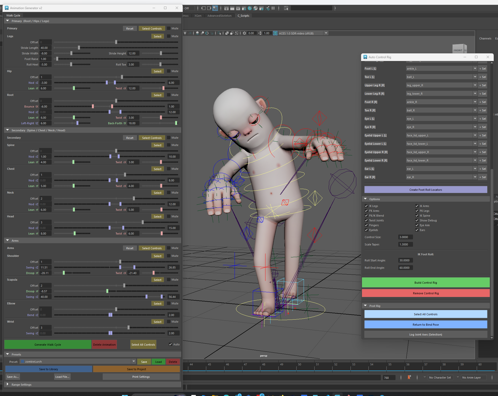

# Maya Python Animation Scripts



A collection of Maya Python scripts for procedural animation generation, rigging, scene cleanup, and Source 2 model import. Designed for **Maya 2026** (Python 3.10, `maya.cmds` only). Built around the **AdvancedSkeleton** rig naming convention and the custom **Auto Control Rig** system.

### Quick Start

```python
# Animation Generator v2
from anim_gen_v2 import launcher; launcher.show()

# Auto Control Rig
import autoControlRig; autoControlRig.show()

# Source 2 Importer
import source2Importer; source2Importer.show()
```

### Package Overview

| Package | Description |
|---|---|
| `anim_gen_v2/` | Layered keyframe engine with walk cycle generator, JSON presets, slider UI |
| `auto_control_rig/` | AdvancedSkeleton-compatible FK/IK control rig builder for any skeleton |
| `source2_importer/` | Import Source 2 `.vmdl` models (mesh, skeleton, textures, materials) into Maya |
| `*.py` (root) | Legacy v1 animation generators, utility scripts, scene cleanup tools |

---

## Animation Generator v2 — `anim_gen_v2`

A layered keyframe engine that generates procedural walk cycles on the Auto Control Rig. Each animation layer (Primary, Secondary, Arms) produces a set of channels that the engine batch-keys across the timeline in a single undo chunk.

**Usage:**
```python
from anim_gen_v2 import launcher
launcher.show()
```

### Architecture

```
┌──────────────┐
│   UI Window  │  floatSliderGrp controls, presets, auto-update
└──────┬───────┘
       │  _read_fields()
       ▼
┌──────────────┐     ┌──────────────┐
│    Layers    │────►│   Channels   │  ctrl, attr, wave, amplitude, offset, ...
│  (Primary,   │     └──────┬───────┘
│  Secondary,  │            │
│  Arms)       │            ▼
└──────────────┘     ┌──────────────┐
                     │    Engine    │  resolve → cutKey → setKeyframe (undo chunk)
                     └──────┬───────┘
                            │
                            ▼
                     ┌──────────────┐
                     │  Maya Scene  │  keyframes on rig controls
                     └──────────────┘
```

### Core Modules

| Module | Purpose |
|---|---|
| `core/engine.py` | Batch keying, timeline helpers, `generate()`, `clear_keys()` |
| `core/channel.py` | `Channel` dataclass — target control, attribute, wave, amplitude, offset, phase |
| `core/patterns.py` | `Wave` enum — COSINE, SINE, CONSTANT with `evaluate()` and `sample()` |
| `core/resolver.py` | Cached case-insensitive Maya node lookup |
| `core/presets.py` | JSON preset save/load — repo library + project presets with auto-discovery |
| `layers/__init__.py` | `Layer` base class — `enabled`, `channels()`, `controls()`, `fkik_state()`, `params()` |
| `ui/window.py` | Tabbed Maya window — sliders, framed sections, mute, presets, auto-update |

### Axis Convention (Joint-Aligned)

All joint-aligned controllers (Root, Hip, Spine, Chest, Neck, Head, Arms) follow:

| Axis | Rotation | Translation (Root) |
|---|---|---|
| **X** | Twist (axial roll) | Bounce (up/down) |
| **Y** | Lean (side bend) | Back-Forth |
| **Z** | Nod (fore/back pitch) | Left-Right |

IK Legs are **world-aligned** (`ro=(0,0,0)`).

### Rhythm Rules

| Movement Type | Frequency | Keyframes | Subdivision |
|---|---|---|---|
| Forward/Back (nod, stride) | 2× per cycle | 5 | Fifths |
| Side/Twist (lean, twist) | 1× per cycle | 3 | Thirds |

### Walk Cycle Layers

**Primary** — Root translation/rotation, hip swing, IK leg stride, foot roll:

| Parameter | Default | Control | Attribute | Note |
|---|---|---|---|---|
| `stride` | 10.0 | IKLeg_R/L | translateZ | Forward/back step |
| `stride_width` | 2.0 | IKLeg_R/L | translateX | Lateral offset |
| `stride_height` | 4.0 | IKLeg_R/L | translateY | Vertical step curve |
| `foot_raise` | 10.0 | IKLeg_R/L | rotateX | Toe lift during swing |
| `foot_roll_heel` | −8.0 | IKLeg_R/L | Roll | Heel strike angle |
| `foot_roll_toe` | 40.0 | IKLeg_R/L | Roll | Toe-off angle |
| `hip_nod` | 10.0 | HipSwinger_M | rotateZ | Hip pitch |
| `hip_lean` | 5.0 | HipSwinger_M | rotateY | Hip side tilt |
| `hip_twist` | 0.0 | HipSwinger_M | rotateX | Hip axial rotation |
| `root_bounce` | 1.5 | RootX_M | translateX | Vertical bounce |
| `root_nod` | 1.0 | RootX_M | rotateZ | Root pitch |
| `root_lean` | 2.0 | RootX_M | rotateY | Root side sway |
| `root_twist` | 0.0 | RootX_M | rotateX | Root axial rotation |
| `root_lr` | 0.0 | RootX_M | translateZ | Lateral root shift |
| `root_bf` | 0.0 | RootX_M | translateY | Forward/back root shift |
| `bounce_offset` | 0.0 | RootX_M | translateX | Phase offset for bounce |
| `root_nod_offset` | 0.0 | RootX_M | rotateZ | Phase offset for nod |

FKIK: `FKIKLeg_L/R = 10` (full IK). Foot roll drives expression-based heel/ball/toetip pivots.

**Secondary** — Spine chain counter-rotation (spine, chest, neck, head):

| Part | Control | Nod (rZ) | Lean (rY) | Twist (rX) | Nod Offset |
|---|---|---|---|---|---|
| Spine | FKSpine_M | 5.0 | 2.0 | 1.5 | 0.0 |
| Chest | FKChest_M | 7.0 | 3.0 | 2.0 | 0.0 |
| Neck | FKNeck_M | 4.0 | 2.0 | 1.0 | 0.0 |
| Head | FKHead_M | 3.0 | 1.5 | 1.5 | 0.0 |

FKIK: `FKIKSpine_M = 0` (full FK). FKSpine_M uses a multiplyDivide node to halve rotation for 50/50 split to both spine joints.

**Arms** — FK arm swing with L/R mirroring:

| Parameter | Default | Axis | Note |
|---|---|---|---|
| `shoulder_droop` | −30.0 | rY | Arms hanging position |
| `shoulder_swing` | 20.0 | rZ | Forward/back arm swing |
| `shoulder_twist` | 0.0 | rX | Axial arm roll |
| `scapula_droop` | −15.0 | rY | Scapula offset |
| `scapula_swing` | 8.0 | rZ | Scapula follow-through |
| `elbow_bend` | 12.0 | rZ | Elbow flexion |
| `wrist_swing` | 6.0 | rZ | Wrist follow-through |

FKIK: `FKIKArm_L/R = 0` (full FK). Left arm uses `mir = −1` on rY/rX amplitudes; phase offset `0.5`.

### Preset System

Presets are JSON files discovered from two locations:

| Source | Path | Tag |
|---|---|---|
| **Library** (repo) | `anim_gen_v2/presets/<cycle_type>/` | `[lib]` |
| **Project** | `<maya_workspace>/data/anim_presets/<cycle_type>/` | `[proj]` |

The UI provides Load Selected, Save to Library, Save to Project, Save As..., and Load File... buttons. Presets store all layer parameters grouped by section with metadata (type, name, author, date).

### UI Features

- **Sliders** (`floatSliderGrp`) with sensible min/max ranges and axis colour coding (🔴 rX, 🟢 rY, 🔵 rZ)
- **Framed sections** per joint group with bold header labels
- **Select** button per section header — selects controls in viewport for Graph Editor work
- **Mute** checkbox per section — stores values, zeros + disables sliders; unmute restores
- **Set to 0** button per major section
- **Auto-update** — regenerates animation on every slider change/drag
- **Delete Animation** — clears all keys in the timeline range (including FKIK and Roll)
- **Preset dropdown** with combined library + project presets

---

## Source 2 Importer — `source2_importer`

Imports Source 2 `.vmdl` character models into Maya — parsing the model definition, importing FBX meshes, converting compiled textures to PNG, and building Maya materials with proper texture connections.

**Usage:**
```python
import source2Importer; source2Importer.show()
```

### Pipeline

```
.vmdl (KV3 text)
  │  kv3.parse() — inline prefab references
  ▼
Parsed structure (meshes, materials, scale)
  │  pipeline.import_model()
  ├──► FBX import (body meshes)
  ├──► VRF CLI: .vtex_c → PNG (texture export)
  └──► materials.process_material() → Maya shaders
```

### Modules

| Module | Purpose |
|---|---|
| `pipeline.py` | Orchestrator — parse vmdl → import FBX → convert textures → create materials |
| `kv3.py` | KV3 (KeyValues 3) text format parser for `.vmdl` and `.vmdl_prefab` files |
| `materials.py` | Maya material creation from Source 2 textures — exports PNGs, builds shaders |
| `vrf.py` | Wrapper for VRF Decompiler CLI (locate, download, invoke) |
| `vrf/` | VRF Decompiler binaries (Source2Viewer-CLI.exe + dependencies) |
| `ui.py` | Maya window — file browser for `.vmdl` path and texture output directory |

### Key Features

- **KV3 parsing** with inline prefab resolution (follows `Prefab` references)
- **Automatic texture export** — all `.vtex_c` files converted to PNG via VRF CLI
- **Material auto-creation** — maps Source 2 material channels to Maya shader nodes
- **Scale handling** — respects the `ScaleAndMirror` modifier (cm → inches at 0.3937)
- **Variant filtering** — skips grey/old/young skin variants, imports default textures only

---

## Animation Generator Scripts (Legacy v1)

### walkcycleGenerator.py — `WalkCycleTool`

Generates a bipedal walk cycle using IK legs and FK upper body.

| Controller | Type | Attributes Keyed | Role |
|---|---|---|---|
| `IKLeg_R` | IK Handle | translateX, translateY, translateZ, rotateX, stretchy | Right foot stride, lift, raise |
| `IKLeg_L` | IK Handle | translateX, translateY, translateZ, rotateX, stretchy | Left foot stride, lift, raise |
| `HipSwinger_M` | FK | rotateX, rotateY | Hip swing (forward/back) and sway (L/R) |
| `RootX_M` | Root | translateX, translateY, translateZ, rotateX, rotateY, rotateZ | Bounce, sway, rock, twist, left-right, back-forth |
| `FKSpine1_M` | FK | rotateX, rotateY, rotateZ | Spine twist/sway/rock |
| `FKChest_M` | FK | rotateX, rotateY, rotateZ | Chest twist/sway/rock |
| `FKNeck_M` | FK | rotateX, rotateY, rotateZ | Neck counter-motion |
| `FKHead_M` | FK | rotateX, rotateY, rotateZ | Head counter-motion |
| `FKScapula_R` | FK | rotateY, rotateZ | Right scapula down + swing |
| `FKScapula_L` | FK | rotateY, rotateZ | Left scapula (mirrored) |
| `FKShoulder_R` / `_L` | FK | rotateX, rotateY, rotateZ | Shoulder down position + arm swing |
| `FKElbow_R` / `_L` | FK | rotateZ | Elbow bend during swing |
| `FKWrist_R` / `_L` | FK | rotateZ | Wrist follow-through |

---

### runCycleGenerator.py — `RunCycleGenerator`

Generates a bipedal run cycle with enhanced dynamics (bounce, lean, corkscrew twist).

| Controller | Type | Attributes Keyed | Role |
|---|---|---|---|
| `RootX_M` | Root | translateX, translateY, translateZ, rotateX, rotateY, rotateZ | Bounce up/down, lean, sway, swing, corkscrew, back-forth |
| `IKLeg_R` | IK Handle | translateX, translateY, translateZ, rotateX | Right foot stride, height, raise |
| `IKLeg_L` | IK Handle | translateX, translateY, translateZ, rotateX | Left foot stride, height, raise |
| `FKChest_M` (alias: `FKChest1_M`) | FK | rotateX, rotateY, rotateZ | Chest bounce, swing, tilt |
| `FKSpine_M` (alias: `FKSpine1_M`) | FK | rotateX, rotateY, rotateZ | Spine bounce, swing, tilt |
| `HipSwinger_M` (alias: `HipSwinger1_M`) | FK | rotateX, rotateY | Hip swing and side motion |
| `FKNeck_M` | FK | translateY, rotateX, rotateY, rotateZ | Neck bounce, rock, lean, sway, swing |
| `FKHead_M` (alias: `FKHead1_M`) | FK | translateY, rotateX, rotateY, rotateZ | Head bounce, rock, lean, sway, swing |
| `FKScapula1_L` / `FKScapula_L` | FK | rotateZ | Left scapula swing |
| `FKScapula1_R` / `FKScapula_R` | FK | rotateZ | Right scapula swing |
| `FKShoulder_L` / `_R` | FK | rotateX, rotateY, rotateZ | Shoulder down, rotate, swing, sway-out |
| `FKElbow_L` / `_R` | FK | rotateZ | Elbow flex (forward bias) |

---

### sideStepGenerator.py — `SideStepGenerator`

Generates a lateral side-step animation with mirroring support.

| Controller | Type | Attributes Keyed | Role |
|---|---|---|---|
| `RootX_M` | Root | translateX, translateY, rotateZ | Root shift, bounce, tilt |
| `IKLeg_R` | IK Handle | translateX, translateY | Right foot lateral step |
| `IKLeg_L` | IK Handle | translateX, translateY | Left foot lateral step |
| `HipSwinger_M` | FK | rotateY | Hip sway (side whip) |
| `FKSpine1_M` | FK | rotateY | Spine sway |
| `FKChest_M` | FK | rotateY | Chest sway |
| `FKNeck_M` | FK | rotateY | Neck sway |
| `FKHead_M` | FK | rotateY | Head sway |
| `FKScapula_L` / `_R` | FK | rotateX, rotateY, rotateZ | Scapula swing + additive down/bent/twist |
| `FKShoulder_L` / `_R` | FK | rotateX, rotateY, rotateZ | Shoulder swing + additive |
| `FKElbow_L` / `_R` | FK | rotateX, rotateY, rotateZ | Elbow swing + additive |
| `FKWrist_L` / `_R` | FK | rotateX, rotateY, rotateZ | Wrist additive pose |

---

### handWalkCycleGenerator.py — `HandWalkCycleTool`

Generates a quadruped-style hand-walk cycle (character walking on hands). Uses IK arms for hand placement and IK legs for feet.

| Controller | Type | Attributes Keyed | Role |
|---|---|---|---|
| `IKArm_R` / `IKArm_L` | IK Handle | translateX, translateY, translateZ, rotateY, stretchy | Hand stride, lift, offsets |
| `RootX_M` | Root | translateX, translateY, translateZ, rotateX, rotateY, rotateZ | Bounce, sway, rock, shift, swing, forward bounce |
| `HipSwinger_M` | FK | rotateX, rotateY | Hip swing and sway |
| `IKLeg_R` / `IKLeg_L` | IK Handle | translateX, translateY, translateZ, rotateX | Feet follow with offsets, bounce, swing, back-forth |
| `FKScapula_L` / `_R` | FK | rotateX, rotateY, rotateZ | Scapula rotation + offsets |
| `FKSpine_M` / `FKSpine1_M` | FK | rotateX, rotateY, rotateZ | Spine swing, rock, sway |
| `FKChest_M` | FK | rotateX, rotateY, rotateZ | Chest swing, rock, sway |
| `FKNeck_M` | FK | translateX, translateY, translateZ, rotateX, rotateY, rotateZ | Neck counter-rotation, bounce, bob, sway |
| `FKHead_M` | FK | translateX, translateY, translateZ, rotateX, rotateY, rotateZ | Head counter-rotation, bounce, bob, sway |
| `PoleArm_R` / `PoleArm_L` | Pole Vector | translateX, translateY, translateZ | Elbow pole positioning |
| `FKIKLeg_R` / `FKIKLeg_L` | Blend | FKIKBlend | FK/IK leg blend (0..10) |
| `FKHip_R` / `_L` | FK | rotateZ | FK leg hip pose |
| `FKKnee_R` / `_L` | FK | rotateZ | FK leg knee pose |
| `FKFoot_R` / `_L` | FK | rotateZ | FK leg foot pose |
| `FKToe_R` / `_L` | FK | rotateZ | FK leg toe pose |

---

### HandSideStepGenerator.py — `HandSideStepGenerator`

Generates a lateral side-step using hands (IK arms) as the stepping limbs.

| Controller | Type | Attributes Keyed | Role |
|---|---|---|---|
| `IKArm_R` / `IKArm_L` | IK Handle | translateX, translateY, stretchy | Hand lateral step, lift |
| `RootX_M` | Root | translateX, translateY, rotateZ | Root shift, bounce, tilt |
| `HipSwinger_M` | FK | rotateY | Hip sway |
| `FKSpine1_M` | FK | rotateY | Spine sway |
| `FKChest_M` | FK | rotateY | Chest sway |
| `FKNeck_M` | FK | rotateY | Neck sway |
| `FKHead_M` | FK | rotateY | Head sway |
| `FKScapula_L` / `_R` | FK | rotateX, rotateY, rotateZ | Scapula swing + additive |
| `FKIKLeg_R` / `FKIKLeg_L` | Blend | FKIKBlend | FK/IK leg blend |
| `FKHip_R` / `_L` | FK | rotateZ | FK leg hip pose (static) |
| `FKKnee_R` / `_L` | FK | rotateZ | FK leg knee pose (static) |
| `FKFoot_R` / `_L` | FK | rotateZ | FK leg foot pose (static) |
| `FKToe_R` / `_L` | FK | rotateZ | FK leg toe pose (static) |

---

### FlightGenerator.py — `FlightGenerator`

Generates a flying/flapping animation cycle using IK arms for wing motion.

| Controller | Type | Attributes Keyed | Role |
|---|---|---|---|
| `IKArm_L` / `IKArm_R` | IK Handle | translateX, translateY, translateZ, rotateX, rotateY | Wing flap (Z), hand flap (Y), positioning (X/Y), arm angle (X) |
| `FKIKArm_L` / `FKIKArm_R` | Blend | FKIKBlend | Arm FK/IK blend (0..10) |
| `RootX_M` | Root | translateY, translateZ, rotateX | Up/down, back/forth translate, rotateX |
| `FKScapula_L` / `_R` | FK | rotateX, rotateY, rotateZ | Scapula flap with offset/base/mid per axis |
| `PoleArm_L` / `PoleArm_R` | Pole Vector | translateX, translateY, translateZ | Elbow pole positioning with offset + base/mid |
| `FKSpine1_M` / `FKSpine_M` | FK | rotateZ | Spine stretch & bend posture |
| `FKChest_M` | FK | rotateZ | Chest stretch & bend posture |
| `FKNeck_M` | FK | rotateZ | Neck stretch & bend posture |
| `FKHead_M` | FK | rotateZ | Head stretch & bend posture |
| `IKLeg_L` / `IKLeg_R` | IK Handle | translateX, translateY, translateZ, rotateX | Feet position and angle during flight |

---

### tailSwingAndWiggleGenerator.py — `TailWiggleGenerator`

Generates oscillating animation on any sequential FK chain (tails, hair, trunks, tentacles, etc.).

| Controller | Type | Attributes Keyed | Role |
|---|---|---|---|
| `FK{name}{N}_{side}` (e.g. `FKhair0_M`) | FK Chain | rotateX, rotateY, rotateZ | Per-joint amplitude, offset, halves/sine patterns |

> The chain is auto-detected from a seed name (e.g., `FKhair0_M` finds `FKhair0_M`, `FKhair1_M`, ...). Supports mirror X/Y/Z globally. Works on any numbered FK chain.

---

## Consolidated Controller Reference

All unique controllers targeted by the animation scripts:

### Root & Body Core
| Controller | Used By |
|---|---|
| `RootX_M` | Walk, Run, SideStep, HandWalk, HandSideStep, Flight |
| `HipSwinger_M` | Walk, Run, SideStep, HandWalk, HandSideStep |
| `FKSpine1_M` / `FKSpine_M` | Walk, Run, SideStep, HandWalk, HandSideStep, Flight |
| `FKChest_M` | Walk, Run, SideStep, HandWalk, HandSideStep, Flight |
| `FKNeck_M` | Walk, Run, SideStep, HandWalk, HandSideStep, Flight |
| `FKHead_M` | Walk, Run, SideStep, HandWalk, HandSideStep, Flight |

### IK Legs
| Controller | Used By |
|---|---|
| `IKLeg_R` | Walk, Run, SideStep, HandWalk, Flight |
| `IKLeg_L` | Walk, Run, SideStep, HandWalk, Flight |

### IK Arms
| Controller | Used By |
|---|---|
| `IKArm_R` | HandWalk, HandSideStep, Flight |
| `IKArm_L` | HandWalk, HandSideStep, Flight |

### FK Arms
| Controller | Used By |
|---|---|
| `FKScapula_R` / `FKScapula_L` | Walk, Run, SideStep, HandWalk, HandSideStep, Flight |
| `FKShoulder_R` / `FKShoulder_L` | Walk, Run, SideStep |
| `FKElbow_R` / `FKElbow_L` | Walk, Run, SideStep |
| `FKWrist_R` / `FKWrist_L` | Walk, SideStep |

### FK Legs (for hand-walk modes)
| Controller | Used By |
|---|---|
| `FKHip_R` / `FKHip_L` | HandWalk, HandSideStep |
| `FKKnee_R` / `FKKnee_L` | HandWalk, HandSideStep |
| `FKFoot_R` / `FKFoot_L` | HandWalk, HandSideStep |
| `FKToe_R` / `FKToe_L` | HandWalk, HandSideStep |

### Pole Vectors
| Controller | Used By |
|---|---|
| `PoleArm_R` / `PoleArm_L` | HandWalk, Flight |

### FK/IK Blend Switches
| Controller | Used By |
|---|---|
| `FKIKArm_L` / `FKIKArm_R` | Flight |
| `FKIKLeg_L` / `FKIKLeg_R` | HandWalk, HandSideStep |

### Dynamic Chains (variable)
| Controller | Used By |
|---|---|
| `FK{name}{N}_{side}` (e.g. `FKhair0_M`) | TailWiggle |

### Custom Attributes Used
| Attribute | On Controllers | Used By |
|---|---|---|
| `stretchy` | IKLeg_R/L, IKArm_R/L | Walk (legs), HandWalk (arms) |
| `FKIKBlend` | FKIKArm_R/L, FKIKLeg_R/L | Flight (arms), HandWalk/HandSideStep (legs) |

---

## Utility Scripts

### clipSetter.py — `GameExporterGenerator`
GUI tool to generate Maya Game FBX Exporter `.mel` preset files. Defines animation clip blocks (name, count, frame length) and outputs clips with frame ranges, optionally with color-tagged house variants.

### SceneCleanup.py / toolsWindow.py
Scene cleanup and utility tools:
- Delete constraints, characters, script nodes, Mental Ray nodes
- Remove legacy plugin requirements
- Rename selected nodes with `_##` suffix
- Delete/rename UV sets, set active UV set
- Grid-place selected objects
- Spiral curve generator
- Circular instance/copy ring generator
- Remove substrings from node names

### renderLayerSetter.py
Automated render layer setup (PyMEL, tested on Maya 2017/2018, uses legacy render layers). Creates per-light render layers, ambient occlusion layer, depth-of-field layer, and per-object mask layers with shader networks.

**Prerequisites:** geometry in a group called `renderset`, a camera called `rendercam`. Shader assignment must be per-object (not per-face).

### simpleCharacterRig_01.py / SimpleCRig.py
Character rigging preparation utilities:
- Mesh mirroring with UV correction
- Pre-rig cleanup (delete constraints, history, mirror meshes, combine)
- AdvancedSkeleton rig creation (calls `asReBuildAdvancedSkeleton`)
- Skin binding to `Root_M`
- Controller shape adjustment (scaling CVs on `RootX_M`, `FKNeck_M`, `FKRoot_M`, `FKSpine1_M`, `FKChest_M`, etc.)

---

## Auto Control Rig — `autoControlRig.py`

Generates AdvancedSkeleton-compatible controls on **any joint hierarchy**, designed for use with the **s&box Citizen character rig** (`citizen_REF.fbx`) but works with any skeleton. A clean intermediate "driver" skeleton is built with proper orientations; IK/FK controls drive the driver joints, which in turn parent-constrain the original skin joints.

**Usage:**
```python
import autoControlRig; autoControlRig.show()
```

### Architecture

```
                     ┌─ FK Controls ──► FK Driver joints ──┐
Main_M ──► RootX_M ──┤                                     ├─ parentConstraint (blended) ──► Skin joints
                     └─ IK Controls ──► IK Driver joints ──┘
```

**Dual-chain FK/IK**: Each limb and the spine gets separate FK and IK driver joint chains. Skin joints receive a dual-target parentConstraint blended by the FKIK weight. The original skeleton is never modified — only constrained. Removing the rig restores the exact bind pose.

- **Main_M** — World-space master controller at the origin. All rig groups (Ctrl_GRP, Driver_GRP, IK_GRP, Misc_GRP) parent under it. ScaleConstraint from Main_M to the root skin joint provides uniform global scaling.
- **chestFollow_M** — Blends between FK and IK chest controls so neck, head, and arms always follow the active spine mode.
- **Space switching** — IK legs: Main / Root. IK arms: Main / Root / Chest / Head. Enum attr on each IK control with condition-driven parentConstraint weights.
- **Driver visibility** — Inactive driver joint chains are hidden via `drawStyle` toggling (Bone ↔ None) so only the active chain is visible.

### s&box Citizen Integration

The script auto-maps the s&box Citizen skeleton joints to rig slots via case-insensitive name matching. The default `SLOT_DEFS` hints cover the Citizen naming convention (`pelvis`, `spine_01`, `thigh_l`, `calf_l`, `foot_l`, `ball_l`, `clavicle_l`, `upperarm_l`, `lowerarm_l`, `hand_l`, etc.). Joint mappings can be saved/loaded as JSON presets for reuse across scenes.

### UI Workflow

1. **From Selection** — select the root joint, click to populate the hierarchy
2. **Auto-Map** — automatically matches joints to rig slots by name hints
3. **Create Foot Roll Locators** — (optional) place heel/toetip locators for precise reverse foot positions
4. **Build Control Rig** — generates the full rig with selected options
5. **Remove Control Rig** — cleanly deletes everything and restores bind pose

### Joint Mapping Slots

| Slot | Label | Side | Example Citizen Joint |
|---|---|---|---|
| `root` | Root / Pelvis | M | `pelvis` |
| `spine` | Spine | M | `spine_01` |
| `spine_1` | Spine 1 | M | `spine_02`, `spine2` |
| `chest` | Chest | M | `spine_03`, `spine_2` |
| `neck` | Neck | M | `neck` |
| `head` | Head | M | `head` |
| `scapula_l/r` | Scapula / Clavicle | L/R | `clavicle_l` |
| `shoulder_l/r` | Upper Arm | L/R | `upperarm_l` |
| `elbow_l/r` | Lower Arm | L/R | `lowerarm_l` |
| `wrist_l/r` | Hand | L/R | `hand_l` |
| `hip_l/r` | Upper Leg | L/R | `thigh_l` |
| `knee_l/r` | Lower Leg | L/R | `calf_l` |
| `foot_l/r` | Foot | L/R | `foot_l` |
| `toe_l/r` | Toe | L/R | `ball_l` |
| `eye_l/r` | Eye | L/R | `eye_l` |
| `eyelid_upper_l/r` | Eyelid Upper | L/R | `eyelid_upper_l` |
| `eyelid_lower_l/r` | Eyelid Lower | L/R | `eyelid_lower_l` |
| `ear_l/r` | Ear | L/R | `ear_l` |

**Fingers** are auto-discovered from child joints under the mapped wrist — no manual slot mapping needed. The system traces branches under each wrist and identifies thumb, index, middle, ring, and pinky chains by keyword matching.

### Controls Created

| Control | Type | Purpose |
|---|---|---|
| `Main_M` | NURBS Circle | World-space master controller, global scale |
| `RootX_M` | NURBS Circle | Master root translation |
| `HipSwinger_M` | NURBS Circle | Hip orientation (parented under RootX_M) |
| `FKSpine_M` | NURBS Circle | Spine FK orient (single controller, 50/50 split to both spine joints via multiplyDivide) |
| `FKChest_M` | NURBS Circle | Chest FK orient |
| `FKNeck_M` | NURBS Circle | Neck FK orient |
| `FKHead_M` | NURBS Circle | Head FK orient |
| `FKScapula_L/R` | NURBS Circle | Scapula FK orient |
| `FKShoulder_L/R` | NURBS Circle | Upper arm FK orient |
| `FKElbow_L/R` | NURBS Circle | Lower arm FK orient |
| `FKWrist_L/R` | NURBS Circle | Hand FK orient |
| `FKHip_L/R` | NURBS Circle | Upper leg FK orient |
| `FKKnee_L/R` | NURBS Circle | Lower leg FK orient |
| `FKFoot_L/R` | NURBS Circle | Foot FK orient |
| `FKToe_L/R` | NURBS Circle | Toe FK orient |
| `IKLeg_L/R` | Box Curve | IK foot placement (ikRPsolver) |
| `IKArm_L/R` | Box Curve | IK hand placement (ikRPsolver) |
| `PoleLeg_L/R` | Cross Curve | Knee pole vector |
| `PoleArm_L/R` | Cross Curve | Elbow pole vector |
| `IKSpine_M` | NURBS Circle | IK spine bottom (hip-level, spline solver) |
| `IKSpineMid_M` | NURBS Circle | IK spine mid (S-curve deformation) |
| `IKChest_M` | NURBS Circle | IK spine top (chest-level, drives appendages) |
| `FKIKSpine_M` | Diamond Curve | Spine FK/IK blend switch (`FKIKBlend` 0–10) |
| `FKIKLeg_L/R` | Diamond Curve | Leg FK/IK blend switch (`FKIKBlend` 0–10) |
| `FKIKArm_L/R` | Diamond Curve | Arm FK/IK blend switch (`FKIKBlend` 0–10) |
| `Fingers_L/R` | Diamond Curve | Master finger control with `Curl`, `Spread`, per-finger curl attrs |
| `FKFinger{Name}{Idx}_L/R` | NURBS Circle | Individual finger joint FK control (auto-discovered) |
| `EyeAim_M` | Cross Curve | Master eye aim target, `EyelidFollow` (0–1), `Space` (Head/Root/World) |
| `EyeAim_L/R` | Diamond Curve | Per-eye aim target (parented under EyeAim_M) |
| `FKEyelidUpper_L/R` | NURBS Circle | Upper eyelid FK control |
| `FKEyelidLower_L/R` | NURBS Circle | Lower eyelid FK control |
| `FKEar_L/R` | NURBS Circle | Ear FK control |

### Build Options

| Option | Default | Description |
|---|---|---|
| IK Legs | On | Create IK leg controls with ikRPsolver |
| IK Arms | On | Create IK arm controls with ikRPsolver |
| IK Spine | On | Create IK spline spine with 3 controllers (bottom, mid, top) |
| FK Arms | On | Create FK arm chain controls |
| FK Legs | On | Create FK leg chain controls |
| FK/IK Blend | On | Create blend switches with visibility toggling and driver chain hiding |
| Twist Joints | On | Create twist joint drivers for upper/lower arm and leg segments |
| Show Debug | Off | Create debug locators on all driver joints and foot roll pivots |
| Fingers | On | Auto-discover and create FK finger controls with master curl/spread |
| Eye Aim | On | Create eye aim controls with per-eye targets and space switching |
| Eyelids | On | Create FK eyelid controls with eye-follow blending |
| Ears | On | Create FK ear controls |
| Control Size | 1.0 | Global scale for all generated controls |
| Scale Taper | 1.3 | FK chain controls taper larger toward root |

### IK Foot Roll (Reverse Foot)

The IK leg setup includes a full **reverse foot roll** system:

- **Reverse hierarchy**: `footFollow → heelPiv → toetipPiv → ballPiv → [IK handle]`
- **SC solver** from foot to toe keeps the toe aimed forward during ball roll
- **Orient constraint** on the toe driver targets `toetipPiv` to keep toes flat on the ground while the heel lifts
- **Expression-driven** — `Roll`, `RollStartAngle`, and `RollEndAngle` are live attributes on the IK foot control that update in real time

| Roll Range | Heel (rx) | Ball (rx) | Toetip (rx) |
|---|---|---|---|
| -90 → 0 | Ramps from -90 to 0 | 0 | 0 |
| 0 → Start | 0 | Ramps 0 → Start | 0 |
| Start → End | 0 | Ramps Start → 0 | Ramps 0 → (End - Start) |

**Foot Roll Locators**: Optional pre-build locators (`footRoll_heel_L/R`, `footRoll_toetip_L/R`) can be positioned to customize heel and toe-tip pivot locations. If absent, default positions are computed from foot/toe joint locations.

### Debug Visualization

When **Show Debug** is enabled, locators are created for:
- All driver joints (`dbg_root`, `dbg_spine`, `dbg_foot_l`, `dbg_toe_l`, etc.)
- Foot roll pivots: `dbg_heelPiv_L/R` (yellow), `dbg_ballPiv_L/R` (yellow), `dbg_toetipPiv_L/R` (brown)

All debug locators are parent-constrained to their targets and track position + rotation in real time.

### IK Spline Spine

When **IK Spine** is enabled, a spline IK solver drives the spine with three controllers:

- **IKSpine_M** — Bottom control at the hip/spine base. Drives first CV of the spline curve.
- **IKSpineMid_M** — Mid control at the spine_1 level. Drives the middle CVs for S-curve deformation.
- **IKChest_M** — Top control at the chest level. Drives last CV. Appendages (neck, head, arms) follow via `chestFollow_M`.

Advanced twist uses object rotation up (start = IKSpine_M, end = IKChest_M). The spline curve has `inheritsTransform` disabled to prevent double transforms. All three IK spine offsets parent under `RootX_M` so they follow the root.

### Twist Joints

When **Twist Joints** is enabled, twist extraction joints are created for upper/lower arm and leg segments. These distribute forearm twist and upper-arm roll across multiple joints for smoother deformation.

### Helper Joint Correctives

Automatic corrective helper joints at elbows and knees that activate based on bend angle to maintain volume during extreme poses.

### Finger Controls

When **Fingers** is enabled, the builder auto-discovers finger joint chains under each mapped wrist joint. For each hand:

- **`Fingers_L/R`** — Diamond-shaped master control positioned above the wrist. Provides:
  - `Curl` (−10 to 10) — drives all fingers simultaneously along the Y axis (×9° per unit)
  - `Spread` (−10 to 10) — fans fingers apart along the Z axis (weighted per finger: thumb −2.5, index −1.0, middle 0, ring 1.0, pinky 2.0)
  - Per-finger `ThumbCurl`, `IndexCurl`, `MiddleCurl`, `RingCurl`, `PinkyCurl` — individual curl overrides that add to the master curl
- **`FKFinger{Name}{Idx}_L/R`** — Individual FK circles per finger joint, parented in chains. Each has a driven `_curl` group for automated curl/spread, plus the FK control itself for manual posing on top.

Finger controls remain visible and functional in both FK and IK arm modes. A `wristFollow` group blends between FK and IK wrist transforms so fingers always track the active hand.

### Eye Aim

When **Eye Aim** is enabled:

- **`EyeAim_M`** — Cross-shaped master aim target, positioned in front of the head. Per-eye diamond targets (`EyeAim_L/R`) are parented under it.
- **Aim constraint** on each eye driver joint uses auto-detected local axes (the builder queries the eye joint's world matrix at build time to find which axis points forward and which points up).
- **`Space`** attribute (enum: Head / Root / World) — switches the aim target's parent space. Default is Head (eyes follow head rotation). Set to World for independent aiming.
- **`EyelidFollow`** attribute (0–1, default 0.5) — controls how much the eyelids track the eye direction.

### Eyelid Controls

When **Eyelids** is enabled:

- **`eyelidGrp_L/R`** — Per-eye group matching the eye driver's orientation, orient-constrained between a rest null (head space) and the eye driver joint. `EyelidFollow` on `EyeAim_M` blends the constraint weights.
- **`FKEyelidUpper_L/R`**, **`FKEyelidLower_L/R`** — FK circles parented under the eyelid group. Manual rotations for blinks and expressions layer on top of the automatic eye-follow.

### Ear Controls

When **Ears** is enabled:

- **`FKEar_L/R`** — FK circles parented under the head control for secondary ear animation.

### Post-Rig Utilities

- **Select All Controls** — selects all NURBS curve controls in the rig (filters by nurbsCurve shapes)
- **Return to Bind Pose** — zeros all control transforms and resets custom attributes to defaults (top-down order, includes Main_M)
- **Remove Control Rig** — deletes all rig nodes, removes skin joint constraints, restores original bind pose transforms

---

## Appendix — s&box Citizen Model (`citizen.vmdl`)

Reference documentation for the s&box default character model. This section describes the Source 2 file structure, what each piece does, and the conventions that well-made s&box models follow. Useful context for anyone building importers, clothing, or replacement characters.

### File Layout

```
models/citizen/
├── citizen.vmdl                    # Root model document (KV3 text, ~200 lines)
├── citizen.vmdl_c                  # Compiled model binary (6.4 MB)
├── citizen.vanmgrph                # Animation graph (state machine, blend trees)
├── citizen.fbx                     # Body mesh source — torso, hands, legs, feet (LOD0)
├── citizen_head.dmx                # Head mesh source — DMX format (3.2 MB, has blend shapes)
├── citizen_REF.fbx                 # Full reference skeleton + mesh (4.6 MB)
├── citizen_lod1..4.fbx             # Progressive LOD body meshes
├── citizen/
│   └── head_lod0_vmorf.vtex_c     # Morph target (blend shape) texture data
├── skin/                           # Materials + textures (see Textures below)
│   ├── *.vmat_c                    # Compiled material definitions
│   └── *.generated.vtex_c         # Compiled textures (exported from PNG/PSD sources)
├── animations/                     # ~293 compiled animation files (.vanim_c)
├── prefabs/                        # 30 vmdl_prefab files (modular sub-documents)
└── subgraphs/                      # Animation sub-state-machines
```

### vmdl Architecture — Prefab Composition

The `citizen.vmdl` root file is a **KV3** (KeyValues 3) text document. It defines 16 top-level system classes, almost all of which delegate to external `.vmdl_prefab` files via `Prefab` references. This modular pattern keeps the root file small and lets systems be edited independently.

```
RootNode
├── AnimConstraintList          → citizen_animconstraintlist.vmdl_prefab
├── ModelModifierList           → inline ScaleAndMirror (scale = 0.3937)
├── MaterialGroupList           → citizen_materialgrouplist.vmdl_prefab
├── RenderMeshList              → citizen_rendermeshlist.vmdl_prefab
├── AnimationList               → 5 prefabs (main, debug, menu, unicycle, visemes)
├── BoneMarkupList              → citizen_bonemarkuplist.vmdl_prefab
├── AttachmentList              → citizen_attachmentlist.vmdl_prefab
├── PhysicsJointList            → citizen_physicsjointlist.vmdl_prefab
├── PhysicsShapeList            → citizen_physicsshapelist.vmdl_prefab
├── HitboxSetList               → citizen_hitboxsetlist.vmdl_prefab
├── IKData                      → citizen_ikdata.vmdl_prefab
├── PoseParamList               → citizen_poseparamlist.vmdl_prefab
├── WeightListList              → citizen_weightlistlist.vmdl_prefab
├── GameDataList                → citizen_gamedatalist.vmdl_prefab
├── BodyGroupList               → citizen_bodygrouplist.vmdl_prefab
└── LODGroupList                → citizen_lodgrouplist.vmdl_prefab
```

The root also sets `anim_graph_name = "models/citizen/citizen.vanmgrph"` and `default_root_bone_name = "pelvis"`.

### Scale Convention

Source files are authored in **centimeters**. The `ModelModifier_ScaleAndMirror` entry converts to Source 2 engine units (inches) at compile time:

> *"We're working in centimeters at the source (which makes more sense for us), and then letting the engine take care of the conversion to inches at this step. So if you want to create something for the Citizen (like clothing), you should also model it in centimeters (matching the provided source files), and use a ScaleAndMirror modifier at 0.3937."*

**Scale factor: 0.3937** (1 cm → ~1 inch ÷ 2.54).

### Mesh Structure (RenderMeshList)

The character is split into **5 body parts**, each with **4 LOD levels**:

| Body Part | LOD0 Source | LOD1–3 Source | LOD4 Source |
|---|---|---|---|
| Head | `citizen_head.dmx` (DMX, has morph targets) | `citizen_lod2.fbx` → `citizen_lod4.fbx` | `citizen_lod4.fbx` |
| Torso | `citizen.fbx` | `citizen_lod1..3.fbx` | `citizen_lod3.fbx` |
| Hands | `citizen.fbx` | `citizen_lod1..3.fbx` | `citizen_lod3.fbx` |
| Legs | `citizen.fbx` | `citizen_lod1..3.fbx` | `citizen_lod3.fbx` |
| Feet | `citizen.fbx` | `citizen_lod1..3.fbx` | `citizen_lod3.fbx` |

Notable mesh settings:
- `use_expensive_tangents = true` — better normal-map quality
- `high_precision_texcoords = true` — sub-pixel UV accuracy
- `calc_per_vertex_curvature = true` — used by skin shaders for subsurface scattering

The head uses **DMX format** (Valve's native mesh format) because it carries morph targets / blend shapes. The body parts use FBX. Each mesh is extracted from the shared FBX using an `exclude_by_default = true` import filter with a per-mesh exception list.

LOD1 still uses the LOD0 head (the developer note says "for now!"). LOD2 is where the head switches to a lower-poly version without morphs.

### LOD Thresholds

| LOD | Threshold | Head | Body |
|---|---|---|---|
| LOD0 | 0.0 (closest) | Head_LOD0 (morphs) | Full detail body |
| LOD1 | 5.0 | Head_LOD0 (still full) | Reduced body |
| LOD2 | 20.0 | Head_LOD2 (no morphs) | Further reduced |
| LOD3 | 40.0 | Head_LOD3 | Lowest body |
| LOD4 | 70.0 (farthest) | Head_LOD4 | Reuses LOD3 body |

Thresholds are in screen-space percentage — lower means the model must be closer to use that LOD.

### Body Groups

Body groups allow runtime toggling of mesh visibility. The citizen has 5:

| Group | Choices | Purpose |
|---|---|---|
| Head | Show / Hide | Toggle head mesh |
| Chest | Show / Hide | Toggle torso mesh |
| Legs | Show / Hide | Toggle legs mesh |
| Hands | Show / Hide | Toggle hands mesh |
| Feet | Show / Hide | Toggle feet mesh |

Clothing addons use body groups to hide the body part they replace (e.g., a jacket hides Chest, gloves hide Hands).

### Materials

7 compiled material files (`*.vmat_c`) in the `skin/` directory:

| | Material | Purpose |
|---|---|---|
| 🟤 | `citizen_skin.vmat_c` | Default skin (base, remapped to `citizen_skin01`) |
| 🟤 | `citizen_skin01.vmat_c` | Active skin material (the remap target) |
| ⚪ | `citizen_skin_grey.vmat_c` | Grey/neutral skin variant |
| ⚪ | `citizen_skin_greyvmat.vmat_c` | Alternate grey skin |
| 🔵 | `citizen_eyes.vmat_c` | Simple eye material (remapped to `citizen_eyes_advanced`) |
| 🔵 | `citizen_eyes_advanced.vmat_c` | Full eye material with iris detail, refraction |
| 🟣 | `citizen_eyeao.vmat_c` | Eye ambient occlusion overlay (shadow around eye socket) |

> 🟤 Skin &nbsp; ⚪ Skin Variant &nbsp; 🔵 Eyes &nbsp; 🟣 Eye AO

The **MaterialGroupList** defines 3 remaps that upgrade the FBX-embedded material names to the final materials:

| FBX Material | → Remapped To |
|---|---|
| `citizen_eyes` | `citizen_eyes_advanced` |
| `citizen_skin` | `citizen_skin01` |
| `citizen_eyeao` | `citizen_eyeao` (identity, no change) |

### Textures

25 compiled texture files (`*.generated.vtex_c`), plus 1 morph target texture.

> 🟤 Default Skin &nbsp; ⚪ Skin Variant &nbsp; 🔵 Eyes (Advanced) &nbsp; ⚫ Eyes (Legacy) &nbsp; 🟣 Eye AO &nbsp; 🟡 Utility

| | Texture | Channel |
|---|---|---|
| 🟤 | `citizen_skin_color_png_*` | Base color (diffuse albedo) |
| 🟤 | `citizen_skin_normal_png_*` | Normal map (tangent-space) |
| 🟤 | `citizen_skin_ao_png_*` | Ambient occlusion |
| 🟤 | `citizen_skin_bentnormal_png_*` | Bent normal (improved AO/GI direction) |
| ⚪ | `citizen_skin_old_color_png_*` | Old skin — color |
| ⚪ | `citizen_skin_old_normal_png_*` | Old skin — normal |
| ⚪ | `citizen_skin_young_color_png_*` | Young skin — color |
| ⚪ | `citizen_skin_young_normal_png_*` | Young skin — normal |
| ⚪ | `citizen_skin_young_ao_png_*` | Young skin — AO |
| ⚪ | `citizen_skin_grey_*_tcolor_*` | Grey skin — color |
| ⚪ | `citizen_skin_grey_*_tnormal_*` | Grey skin — normal |
| ⚪ | `citizen_skin_grey_*_tambientocclusion_*` | Grey skin — AO |
| ⚪ | `citizen_skin_grey_*_tselfillummask_*` | Grey skin — self-illumination mask |
| 🔵 | `citizen_eyes_advanced_color_png_*` | Eye color (sclera + iris) |
| 🔵 | `citizen_eyes_advanced_normal_png_*` | Eye normal map |
| 🔵 | `citizen_eyes_advanced_iris_mask_psd_*` | Iris mask (isolates iris region) |
| 🔵 | `citizen_eyes_advanced_iris_normal_png_*` | Iris-specific normal detail |
| 🔵 | `citizen_eyes_advanced_*_tocclusion_*` | Eye occlusion |
| ⚫ | `citizen_eyes_color_png_*` | Simple eye color (legacy) |
| ⚫ | `citizen_eyes_trans_png_*` | Eye transparency (legacy) |
| ⚫ | `citizen_eyes_*_tcombinedmasks_*` | Combined channel masks (legacy) |
| ⚫ | `citizen_eyes_*_tnormal_*` | Eye normal (legacy) |
| 🟣 | `citizen_eyeao_*_tambientocclusion_*` | Eye socket AO shadow |
| 🟣 | `citizen_eyeao_*_tnormal_*` | Eye AO normal |
| 🟡 | `tint_lookup_png_*` | Color tint lookup table (runtime skin tone) |

All texture filenames end in `.generated.vtex_c` (truncated above for readability).

### Skeleton & Bone Markup

Root bone: `pelvis`. The skeleton includes IK targets, aim matrices, twist distribution bones, and helper bones.

**Bone markup categories** (from `citizen_bonemarkuplist.vmdl_prefab`):

| | Category | Purpose |
|---|---|---|
| 🔴 | `BoneMarkup_root_IK` | IK targets (feet, hands), aim matrices, root IK bone |
| 🟠 | `BoneMarkup_limb_containers` | Parent bones for limb segments — only twist children do actual skinning |
| 🟢 | `BoneMarkup_helpers` | Helper/corrective bones (e.g., knee caps, elbow positions) |
| ⚫ | `BoneMarkup_twist_old_discard` | Legacy twist bones marked for removal |
| 🔵 | `BoneMarkup_twist0` / `twist1` | Active twist distribution bones (upper/lower arm & leg) |

> 🔴 IK &nbsp; 🟠 Limb Containers &nbsp; 🟢 Helpers &nbsp; ⚫ Deprecated &nbsp; 🔵 Active Twist

### IK Chains

4 IK chains defined in `citizen_ikdata.vmdl_prefab`:

- `right_leg_IK` / `left_leg_IK`
- `right_arm_IK` / `left_arm_IK`

### Attachment Points

37 named attachment points on the skeleton:

> 🟢 Gameplay &nbsp; 🔴 IK Targets &nbsp; 🟣 Aim &nbsp; 🔵 Reference &nbsp; 🟡 Twist Drivers

| | Attachments | Purpose |
|---|---|---|
| 🟢 | `hat`, `eyes` | Wearable / accessory attachment |
| 🟢 | `hold_L`, `hold_R` | Held-object grip points |
| 🟢 | `hand_L`, `hand_R` | Hand attachment (general) |
| 🔴 | `IK_left_hand`, `IK_right_hand` | IK hand targets |
| 🔴 | `foot_L`, `foot_R` | IK foot targets |
| 🟣 | `aim_matrix_01` | Primary aim reference |
| 🟣 | `aim_matrix_02a`, `aim_matrix_02b` | Secondary aim references |
| 🔵 | `forward_reference` | Forward direction (world) |
| 🔵 | `forward_reference_modelspace` | Forward direction (model-space) |
| 🔵 | `middle_of_both_hands` | Midpoint between hands |
| 🔵 | `eye_L_forward`, `eye_R_forward` | Eye forward vectors |
| 🟡 | `driver_arm_upper_L/R_twist1` | Upper arm twist driver |
| 🟡 | `driver_arm_lower_L/R_twist1` | Lower arm twist driver |
| 🟡 | `driver_leg_upper_L/R_twist1` | Upper leg twist driver |
| 🟡 | `driver_leg_lower_L/R_twist1` | Lower leg twist driver |

### Hitboxes

20 hitboxes covering the full body, each attached to its corresponding bone:

`HB_head`, `HB_neck_0`, `HB_spine_0/1/2`, `HB_pelvis`, `HB_clavicle_L/R`, `HB_arm_upper_L/R`, `HB_arm_lower_L/R`, `HB_hand_L/R`, `HB_leg_upper_L/R`, `HB_leg_lower_L/R`, `HB_ankle_L/R`

### Physics & Cloth

Physics is split across three prefabs:
- `citizen_physicsshapelist.vmdl_prefab` — ragdoll collision shapes
- `citizen_physicsjointlist.vmdl_prefab` — ragdoll joint constraints
- `citizen_clothshapelist_upper.vmdl_prefab` / `_lower.vmdl_prefab` — cloth simulation regions

### Animations

The animation system uses a **state-machine animation graph** (`citizen.vanmgrph`) with ~293 animation files spread across 5 animation list prefabs:

| | Prefab | Content |
|---|---|---|
| 🟢 | `citizen_animationlist.vmdl_prefab` | Main locomotion, actions, idles (~359 AnimFile entries) |
| 🔵 | `citizen_animationlist_menu.vmdl_prefab` | Menu/UI character poses |
| 🟣 | `citizen_animationlist_visemes.vmdl_prefab` | Lip-sync viseme shapes |
| 🟡 | `citizen_animationlist_debug.vmdl_prefab` | Debug/test animations |
| 🟠 | `citizen_animationlist_unicycle.vmdl_prefab` | Unicycle locomotion set |

> 🟢 Core &nbsp; 🔵 Menu &nbsp; 🟣 Visemes &nbsp; 🟡 Debug &nbsp; 🟠 Special

Animations also reference **processing prefabs** for post-processing rules:
- `citizen_ani_process_walk.vmdl_prefab` — walk cycle processing
- `citizen_ani_process_run.vmdl_prefab` — run cycle processing
- `citizen_ani_process_crouchwalk.vmdl_prefab` — crouch walk processing
- `citizen_ani_process_crouchwalklow.vmdl_prefab` — low crouch walk processing

### Key Conventions for s&box Models

1. **Author in centimeters**, apply `ScaleAndMirror` at **0.3937** to convert to engine inches
2. **Split body into body groups** so clothing can hide/replace individual parts
3. **Use DMX for heads** with morph targets; FBX for body parts
4. **Provide 4–5 LOD levels** with screen-space thresholds for automatic switching
5. **Use prefab composition** — keep the root `.vmdl` small, delegate to `_prefab` files
6. **Material remapping** — FBX-embedded material names map to final engine materials via MaterialGroupList
7. **Bone naming** follows Source 2 conventions: `pelvis`, `spine_0/1/2`, `arm_upper_L`, `ankle_R`, etc.
8. **Twist bones** use a two-tier system (`twist0` + `twist1`) for smooth limb deformation
9. **Bent normals** alongside regular normals improve subsurface scattering quality on skin
10. **Tint lookup textures** enable runtime skin-tone variation without duplicate materials

---

## Roadmap — Planned Features & Ideas

Informed by state-of-the-art rigging systems (AdvancedSkeleton, mGear, Rapid Rig, Houdini KineFX/APEX, Unreal Control Rig). Organized roughly by priority and complexity.

### High Priority

| Feature | Description | Status |
|---|---|---|
| **Space Switching** | IK legs: Main / Root. IK arms: Main / Root / Chest / Head. Enum attr with condition-driven parentConstraint weights. | ✅ Done |
| **IK/FK Snap Matching** | One-click buttons to match FK pose → current IK result and vice versa. Eliminates pose pops when blending. | Planned |
| **Stretchy IK Limbs** | Distance-based limb stretching via joint scale when IK target exceeds chain length. Soft-IK falloff to prevent pop at full extension. | ✅ Done |
| **Finger / Hand Controls** | FK chain per finger with master curl, spread, and fist attributes on a single hand control. | ✅ Done |
| **Global Scale** | ScaleConstraint from Main_M to root skin joint. Uniform scaling of rig + mesh. | ✅ Done |
| **Eye Aim / Look-At** | Per-eye aim targets with master control. Space switching (Head/Root/World). Eyelid follow blending. | ✅ Done |
| **Procedural Walk Cycle** | Layered keyframe engine (anim_gen_v2) with slider UI, presets, foot roll, mute sections. | ✅ Done |
| **Source 2 Import** | Import `.vmdl` models — parse KV3, import FBX, convert textures via VRF, build Maya materials. | ✅ Done |

### Medium Priority

| Feature | Description | Status |
|---|---|---|
| **IK Spine (Spline IK)** | 3-controller IK spline (bottom/mid/top) with FK/IK blend, chest follow for appendages, advanced twist. | ✅ Done |
| **Twist Joints** | Twist extraction joints for upper/lower arm and leg segments. Smooth forearm and upper-arm roll. | ✅ Done |
| **Eyelids** | FK eyelid controls with per-eye groups, eye-follow blending via `EyelidFollow` attribute. | ✅ Done |
| **Ears** | FK ear controls parented under head for secondary ear animation. | ✅ Done |
| **IK Foot Roll** | Expression-driven reverse foot (Roll, RollStartAngle, RollEndAngle) with heel/ball/toetip pivots. | ✅ Done |
| **Head Aim / Look-At** | Aim constraint on head with a world-space target locator. Auto look-at with adjustable blend. | Planned |
| **Prop / Object Attachment** | Pre-built parent-constraint slots on hand, head, and back joints so props can be parented to the rig with one click. Space-switchable between hands. | Planned |
| **Soft IK** | Smoothly ease into full extension instead of snapping. Node-based falloff curve before the IK chain reaches max length. | Planned |
| **Bendy / Ribbon Limbs** | Ribbon surface or spline-based intermediate deformation between main joints, giving volume-preserving bends at elbows and knees. | Planned |

### Lower Priority / Nice to Have

| Feature | Description | Status |
|---|---|---|
| **Animation Picker** | 2D visual picker panel (HTML or Qt-based) showing a character silhouette with clickable regions to select controls. | Planned |
| **Mirror Pose / Flip Animation** | Mirror selected keyframes or current pose from L↔R. Copy arm/leg pose across sides with axis correction. | Planned |
| **Secondary Dynamics / Jiggle** | Spring/jiggle solver on FK chains (hair, cloth, accessories) with damping and stiffness controls. | Planned |
| **Corrective Blend Shapes** | Pose-space deformation driver: activate corrective blend shape targets based on joint rotation thresholds. | Planned |
| **Volume Preservation** | Squash-and-stretch scaling perpendicular to joint compression. Applied to spine, limbs, and neck. | ✅ Done |
| **Reverse Foot Improvements** | Toe tap, toe wiggle, bank (inner/outer edge roll), and heel swivel attributes. Side-roll pivot locators. | Planned |
| **Control Shape Library** | Swappable control curve shapes per control, selectable at build time or post-build. | Planned |
| **Rig Versioning / Update** | Rebuild the rig without losing animation. Store animation, remove rig, rebuild, reapply. | Planned |
| **Proxy Geo Display** | Low-poly proxy geometry per limb segment that follows the rig, toggleable for fast viewport playback. | Planned |
| **Animation Layer Support** | Additive animation layers on controls so base cycles can have layered adjustments without destructive edits. | Planned |


